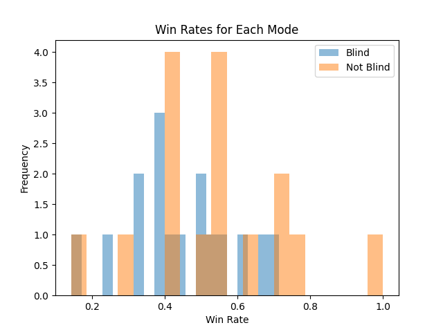
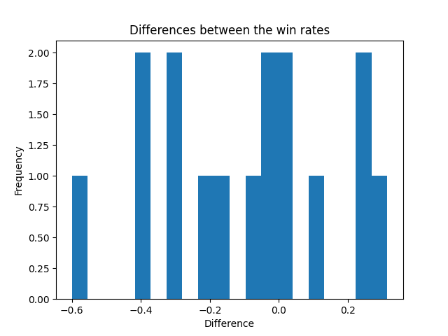

# Results

## Checking the distribution of the data

Before performing any hypothesis tests, it's important to assess the distribution of the data. Let's start by examining the distribution of the winning percentages for both the non-blind and blind modes.

Starting from a graphical analysis, we can create histograms for both the non-blind and blind mode winning percentages to visually inspect their distributions.

The histograms show that the winning percentages for both the non-blind and blind modes are approximately normally distributed. This is further supported by the Shapiro-Wilk test for normality, which yields p-values of approximately 0.073 and 0.091 for the non-blind and blind mode winning percentages, respectively. These p-values are above the common threshold of 0.05 used to denote statistical significance, suggesting that the winning percentages for both modes do not significantly deviate from a normal distribution.
Based on these results, it's reasonable to conclude that the assumption of normality for the winning percentages in both modes is met, justifying the use of parametric tests like the paired samples t-test for analyzing these data.

## Comparing the winning percentages

The Shapiro-Wilk test for normality on the differences between the non-blind and blind mode winning percentages yields a statistic of approximately 0.984 and a p-value of approximately 0.914. This suggests that the differences between paired observations do not significantly deviate from a normal distribution, as the p-value is well above the common threshold of 0.05 used to denote statistical significance.

Additionally, the Q-Q plot visually supports this finding. The data points closely follow the 45-degree line, indicating that the differences are approximately normally distributed.

Based on these results, it's reasonable to conclude that the assumption of normality for the differences between the paired observations is met, justifying the use of parametric tests like the paired samples t-test for analyzing these data.

## Hypothesis test

Now that we've confirmed the normality of the data, we can proceed with the hypothesis test. We'll use a paired samples t-test to compare the winning percentages between the non-blind and blind modes.

The paired samples t-test between the non-blind and blind mode winning percentages resulted in a t-statistic : **t-statistic = -1.4700373650445964, p-value = 0.1622143698930308**.

The results of the paired samples t-test you provided are used to compare the difference between two groups of data (in this case, the winning percentages in non-blind and blind modes) to see if this difference is statistically significant. The paired samples t-test is commonly used when there are two measurements on the same group, subject, or entity, taken under different conditions (for example, before and after a treatment, or in two different experimental conditions such as non-blind and blind modes in this context).

- **T-statistic**: The value of -1.4700373650445964 indicates the distance between the mean of the observed differences and the hypothesized mean of differences (often zero, if no difference is hypothesized) measured in terms of standard error. A negative value indicates that the mean of the observed differences is lower than the hypothesized mean. However, the direction (positive or negative) alone does not determine significance.

- **P-value**: The value of 0.1622143698930308 represents the probability of obtaining a result at least as extreme as the one observed, assuming that the null hypothesis is true. The null hypothesis, in this case, presumably states that there is no significant difference between the two conditions being tested. A p-value greater than 0.05 (a common threshold for statistical significance) suggests that there is not enough evidence to reject the null hypothesis. In other words, there is no statistically significant difference between the winning percentages in non-blind and blind modes.

## Conclusion

Based on the results of the hypothesis test, we fail to reject the null hypothesis. There is no statistically significant difference between the winning percentages of players in non-blind and blind modes. This suggests that, on average, the mode of the game (non-blind vs. blind) does not significantly affect the winning percentages of the players in this sample.

This finding has important implications for game design and player experience. It suggests that the blind mode does not significantly disadvantage players in terms of winning percentages compared to the non-blind mode. This may help inform decisions about game design and accessibility, as it indicates that the blind mode does not significantly impact player performance in this context.

